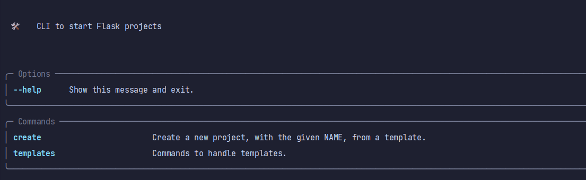
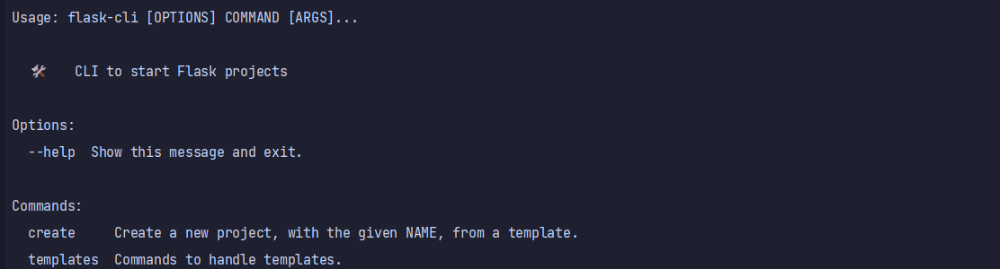

# Flask-CLI

From [Neoteroi/BlackSheep-CLI](https://github.com/Neoteroi/BlackSheep-CLI) .

🛠️ CLI to start [flask](https://github.com/pallets/flask) projects.

- Interactive project scaffolding
- Support for configuring more [`cookiecutter`](https://github.com/cookiecutter/cookiecutter) project templates

```bash
pip install flasky-cli
```

## Project templates

- [cookiecutter-flask](https://github.com/cookiecutter-flask/cookiecutter-flask)
- [cookiecutter-flask-minimal](https://github.com/candidtim/cookiecutter-flask-minimal)
- [cookiecutter-flask-skeleton](https://github.com/testdrivenio/cookiecutter-flask-skeleton)
- [cookiecutter-Flask-Foundation](https://github.com/JackStouffer/cookiecutter-Flask-Foundation)
- [Flask-API](https://github.com/jennier0107/Flask-API)

## Creating a new project

```bash
flask-cli create
```

## Listing the project templates

```bash
flask-cli templates list
```

With details:

```bash
flask-cli templates details
```

## Cli mode
By default, the rich mode is active .

### Deactivate rich mode
#### Windows
```commandline
set NO_RICH=1
```
or
```commandline
set NO_RICH=True
```

#### Linux/macOS
```commandline
export NO_RICH=1
```
or
```commandline
export NO_RICH=True
```



reactivate rich mode use `NO_RICH=0` or `NO_RICH=False`    


## Thanks

- [Neoteroi](https://github.com/Neoteroi)
- [cookiecutter-flask](https://github.com/cookiecutter-flask)
- [candidtim](https://github.com/candidtim)
- [testdrivenio](https://github.com/testdrivenio)
- [JackStouffer](https://github.com/JackStouffer)